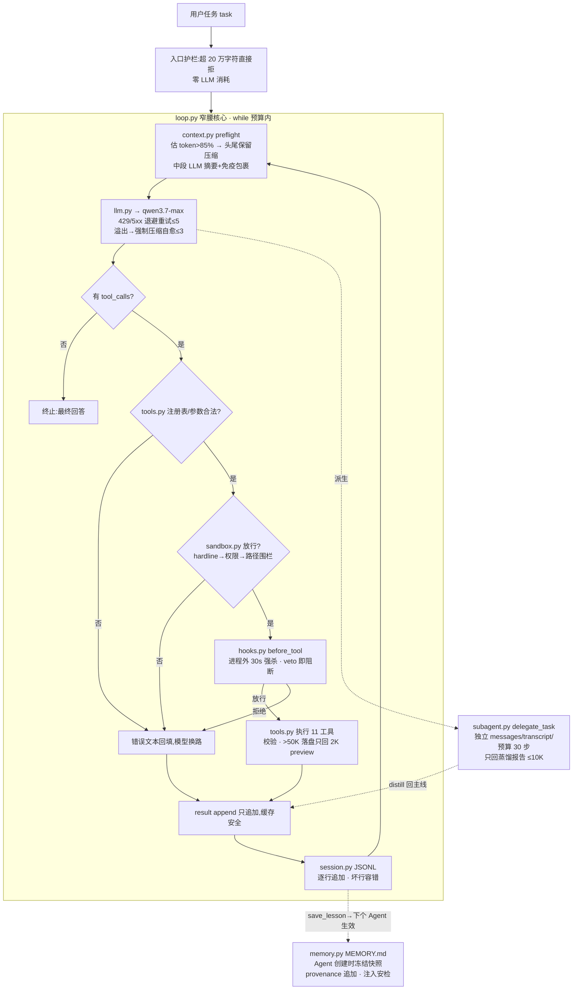

# miniagent

**最小完备 Coding Agent 的设计、实现与验证** —— 把一个只会生成 token 的模型(默认 `qwen3.7-max`,30 万上下文),变成一个能读文件、跑命令、记教训、守边界的工程实体。

核心约 1,500 行(15 个 Python 文件、13 个实质模块),唯一第三方依赖 `requests`。Python 3.10+,零编译,Docker 可跑。

> 📄 **[完整技术报告(PDF,13 页)](docs/miniagent_report_full.pdf)** — 概览 · 模块设计 · 如何运行 · 对比报告 · 问题与解决 · 工程问答(16 题) · 压力测试
> 📄 **[工程问答独立 PDF](docs/miniagent_interview.pdf)** — DeepSeek Agent 岗三面连环追问 × 实战回答
>
> 每个模块 = 一个文件 = 一个"最小设计" + 必要的第 1~2 级演化;**每份复杂性都对应一个真实痛点**。

## 设计宪法

| | 宪法 | 落地 |
|---|---|---|
| 一 | **Prompt Cache 神圣** | 同一 Agent 会话内 system 前缀冻结；压缩只替换中段并保留头尾 |
| 二 | **窄腰核心** | 核心 = 一个循环 + 一个消息列表 + 一个工具调用协议;沙盒/记忆/技能/Hooks/ACP 全部挂在边上 |

## 三层架构

```
表面层   cli.py(终端交互/一次性任务) · web.py(HTTP 查询表单) · acp.py(stdio JSON-RPC 宿主)
─────────────────────────────────────────────────────────────────
Harness  loop.py(窄腰核心 Agent:while ask→act→append)
          ├─ context.py   每步 preflight 压缩(85% 阈值/头尾保留/免疫包裹)
          ├─ tools.py     Agent 实例级 ToolRuntime + 11 工具 + 校验 + 50K 落盘治理
          ├─ sandbox.py   注册表同源工具集→hardline→三分级→路径工具围栏
          ├─ hooks.py     Agent 实例级 HookManager + 进程外 hook(30s 强杀)+ stop 闩锁
          ├─ memory.py    MEMORY.md 冻结快照 + provenance 追加 + 注入安检
          ├─ skills.py    SKILL.md 索引常驻一行 + 正文按需注入
          ├─ subagent.py  delegate_task 隔离派生(独立上下文/预算/transcript)
          └─ session.py   JSONL transcript + 压缩快照重放(坏行容错)
─────────────────────────────────────────────────────────────────
模型层   llm.py → qwen3.7-max(OpenAI 兼容,429/5xx 指数退避重试)
```

## 整体工作流



**如何读这张图**:主线是中间纵列的一次 turn — 每一步先过 preflight(窗口没超就原样放行,前缀不动即缓存命中),再把消息列表发给模型;模型要么回文本(不调工具→循环结束),要么回 `tool_calls`。每次工具调用依次经过注册/参数校验 → hardline/权限裁决 → before_tool hook；未知、畸形或危险调用不会进入 before_tool/handler，after_tool 仍统一收到失败结果。任何一环说"不"都把错误文本回填给模型自行换路 — **这是 miniagent 最核心的自愈语义**。

**一个真实 turn 的走读**(历史压测任务,30 万窗口被真实逼近):模型先 `read_file` 一个 240KB 日志 → 结果治理触发,全量 255,935 字符落盘,模型只见 2,130 字符 preview + 文件路径 → 模型按 preview 判断再 grep 定位 → 若干步后 preflight 估算超 85%,中段被摘要压缩(免疫包裹注入,system 与首条 user 原样保留)→ 任务继续直到最终总结。消息与压缩后的消息快照都写入 transcript；`--resume` 按事件顺序恢复压缩后的真实上下文，而不是回到压缩前。

## 模块设计(13 模块 · 每模块:职责→分级→防什么事故)

分级含义:**[L0]** 骨架(能跑) · **[L1]** 健壮(失败路径处理) · **[L2]** 生产化(生产事故反推的机制) · **[L3]** 演化(对照 kimi/Hermes 的下一级,按需取不强上)。

| # | 模块 | 行 | 职责一句话 | 分级 | 防什么事故 | 参照物 |
|---|---|---|---|---|---|---|
| 1 | `loop.py` | 约 200 | 主循环 ask→act→append,唯一窄腰核心 | [L2] | 死循环烧钱、崩溃丢进度、不可回放 | kimi 主循环 |
| 2 | `context.py` | 约 100 | 每步 preflight 压缩(85% 阈值) | [L2] | token 溢出即死;粗暴截断打碎缓存 | kimi 阈值+头尾保留 |
| 3 | `tools.py` | 约 310 | 实例级 runtime+11 工具注册/校验/治理 | [L2] | 会话串绑、schema 漂移、超长结果灌窗 | kimi 截断+落盘 |
| 4 | `sandbox.py` | 约 100 | 注册表同源名单+hardline+权限+路径围栏 | [L3] | 未知工具、危险命令、路径越界 | Hermes hardline 先于 yolo |
| 5 | `memory.py` | 约 90 | 冻结快照+追加+快照/搜索注入安检 | [L2] | 跨项目串记忆、毒记忆劫持新会话 | kimi AppendLogStore |
| 6 | `skills.py` | 约 80 | 索引一行常驻,正文按需取 | [L1] | 提示词膨胀撑爆前缀缓存 | kimi 三层披露 |
| 7 | `hooks.py` | 约 130 | 实例级 5 事件+进程外 hook+闩锁 | [L2] | 会话串 hook、hook 崩溃、stop 死锁 | kimi stopHook 闩锁 |
| 8 | `acp.py` | 约 85 | stdio JSON-RPC 多 session 分发 | [L1] | 一条 print 毁掉协议流、session 串线 | ACP 协议 |
| 9 | `session.py` | 约 80 | JSONL 消息/压缩快照重放+TTL | [L2] | 压缩后 resume 回退;并发文件名碰撞 | kimi append-only |
| 10 | `subagent.py` | 约 30 | delegate_task 上下文隔离派生 | [L1] | 探索污染主线;父子压缩分叉 | kimi 扁平子代理 |
| 11 | `llm.py` | 约 100 | OpenAI 兼容+退避重试+溢出自愈 | [L2] | 429/5xx、arguments 解析失败 | kimi 溢出自愈≤3 |
| 12 | `cli.py` | 约 90 | 交互/一次性/ask 三形态 | [L1] | GBK 乱码、无恢复入口 | — |
| 13 | `web.py` | 约 150 | HTTP 表面+独立 workdir+并发闸 | [L1] | 请求串目录、超时后并发闸失效 | — |

### 逐模块详述

**1. 主循环 `loop.py`[L2]** — ask→act→append。消息列表是会话状态;终止由模型决定(不调工具即结束);工具错误作为文本回填让模型自愈;正常步骤只追加，压缩则以显式快照事件替换中段。`MAX_STEPS`(默认 60)预算硬墙兜底,耗尽后给一次 grace 收尾调用。

**2. 上下文 `context.py`[L2]** — chars/4 粗估;超 85% `MAX_CONTEXT`(默认 30 万)触发,未触发原样返回(缓存安全)。head = system + 首条 user;tail 从尾部倒走 ≤20% 预算;**不切 tool_call/result 对**;最后一条 user 必须在 tail。中段 LLM 摘要以 `[CONTEXT COMPACTION — REFERENCE ONLY]` 免疫包裹;摘要失败 fail-open 不阻塞主循环。

**3. 工具 `tools.py`[L2]** — schema+handler 字典注册表。11 个内置工具:`read_file` / `list_dir` / `grep` / `glob` / `write_file` / `edit_file` / `bash` / `skill_view` / `save_lesson` / `delegate_task` / `memory_search`。每个 Agent 创建时冻结一个 `ToolRuntime` 注册表快照并绑定自己的 sandbox/skills/memory；required、类型、额外参数和重复/非法注册都 fail-fast。结果超 50K 字符全量落盘 `.miniagent/tool_results/`,模型只见 2K preview + 路径;bash 输出 30K 截断。

**4. 沙盒权限 `sandbox.py`[L3 最小版]** — 已知工具/只读属性由当前 ToolRuntime 生成，不再维护第二份易漂移名单。裁决顺序:hardline(`rm -rf /`、mkfs、dd 裸设备等,**yolo 也不放行**)→ 未知工具 fail-closed → 只读放行 → ask/auto/yolo。所有内置路径型文件工具都经过 realpath workdir 围栏；bash 仅固定 cwd、剥离敏感环境变量并做规则裁决，**不是容器/进程级文件系统隔离**。

**5. 记忆 `memory.py`[L2]** — 每个 workdir 独立一份 `MEMORY.md`；会话开始烘焙快照后冻结,会话中 `save_lesson` 追加且下个会话生效。lesson 被规范为单条记录，快照与 `memory_search` 都逐行做 promptware 过滤；超限截断走 tmp+rename。相同 workdir 的会话有意共享项目记忆，不同 workdir 不共享。

**6. 技能 `skills.py`[L1]** — 扫描项目 `skills/` 与 workdir `.miniagent/skills/`;frontmatter(name/description)常驻 system prompt 一行索引。正文按需:`skill_view(name)` 工具取全文(三层披露的最小两层)。

**7. Hooks `hooks.py`[L2]** — 每个 Agent 从全局配置复制独立 `HookManager`，`on_event` 不会污染其他会话。5 事件:`session_start` / `session_end` / `before_tool` / `after_tool` / `stop`;只有 before_tool 和 stop 可阻断。未知/畸形/权限拒绝的调用不会触发 before_tool。

**8. ACP `acp.py`[L1]** — 方法:initialize / session/new / session/prompt;未知带 id 方法显式 `-32601`;notification 静默。stdout 只走协议帧,日志全重定向 stderr。

**9. 会话持久化 `session.py`[L2]** — 每条消息/事件一行 JSON；压缩与溢出自愈事件携带替换后的消息快照，resume 按事件顺序恢复。会话文件名用独占创建避免同秒并发碰撞；坏行跳过，TTL 默认 30 天。

**10. 子代理 `subagent.py`[L1]** — `delegate_task` 派生全新 Agent 实例:独立 messages / ToolRuntime / HookManager / transcript / 预算 / stop 闩锁。父压缩碰不到子上下文，只回传最终文本(≤10K)。为了能操作同一项目，子代理**有意共享 workdir 与该目录的项目记忆/文件**；这不是文件写入隔离。

**11. LLM 客户端 `llm.py`[L2]** — OpenAI 兼容 chat;`enable_thinking:false`(qwen3 系必须);429/5xx/超时指数退避 ×2 上限 30s + 20% 抖动 + 尊重 Retry-After,最多 5 次;上下文溢出错误→force=True 强制压缩后重试,连续 3 次放弃;arguments JSON 解析失败标记会作为工具错误回填，而不会调用 hook/handler。

**12. CLI `cli.py`[L1]** — 交互/一次性/ask 三形态;`/exit` `/model <模型名>` `/memory` `/compact`;`--resume` 重放;`--cleanup-days`;启动即 stdout/stderr reconfigure utf-8(Windows GBK 修复)。

**13. Web `web.py`[L1]** — 每个请求生成独立 workdir；默认并发闸为 1。HTTP 超时只能放弃等待，不能安全杀死 Python 工作线程，因此闸门会保持占用到后台任务真实结束，避免超时任务与新任务重叠。

## 每模块工作流(分层表)

| 模块 | 层 | 输入 | 输出 | 处理(关键步骤) |
|---|---|---|---|---|
| loop | 主管 | messages(上轮) | 最终文本/新 messages | ① preflight 压缩检查→② llm.chat→③ 有 tool_calls?→裁决链→执行→append→回①;无→终止 |
| context | 治理 | messages + MAX_CONTEXT | 压缩后 messages | ① chars/4 估算→② >85%? 否=原样返回(缓存安全)→③ head=system+首 user 定界→④ tail 倒走 ≤20% 预算、不切协议对→⑤ 中段 LLM 摘要+免疫包裹→⑥ 失败 fail-open |
| tools | 执行 | tool_calls(name+args) | result 消息(或落盘路径) | ① 实例注册表查名→② required/类型/额外参数校验→③ sandbox→before_tool→handler→after_tool→④ >50K 落盘 |
| sandbox | 裁决 | 已注册 tool+args+模式 | 允许/询问/拒绝 | ① 注册表同源名单→② hardline→③ 只读/ask/auto/yolo→④ 路径工具 realpath 围栏；bash 仅规则裁决+环境剥离 |
| hooks | 事件 | 5 事件 payload | 放行/veto | ① 查回调表→② 进程外 hook:子进程+stdin JSON→③ 30s 强杀→④ stdout 裁决;stop 事件:一次性闩锁防永续 |
| memory | 会话边界 | MEMORY.md(磁盘) | system 尾部快照/追加结果 | session_start:① 读文件→② 逐行注入安检→③ 烘焙 system 后冻结;会话中:save_lesson→UTC provenance 追加;超限→tmp+rename 截断 |
| skills | 按需 | skills/ 目录 | 索引行/skill 正文 | ① 扫描 frontmatter→② name+description 一行进 system(常驻)→③ skill_view(name) 按需取正文 |
| subagent | 派生 | task 描述 | distill 报告(≤10K) | ① 全新 Agent 实例(独立 messages/transcript/预算 30)→② 同前缀 system(暖缓存)→③ 子代理独立 mini-loop→④ 最终文本截断回传,过程不进主线 |
| session | 持久 | 消息/压缩事件 | JSONL 一行 | ① append→② compact/overflow 快照替换旧上下文→③ resume 顺序重放,坏行跳过→④ TTL 清理 |
| llm | 通信 | messages+tools schema | resp(content+tool_calls+usage) | ① enable_thinking:false→② 429/5xx 指数退避≤5→③ 溢出错误→强制压缩重试≤3→④ arguments 解析失败降级 error 标记→⑤ usage 账本累加 |
| acp | 表面 | stdin JSON-RPC 帧 | stdout 协议帧 | ① 每行一帧解析→② initialize/session_new/session_prompt 分发→③ 未知带 id→-32601→④ notification 静默;日志全走 stderr |
| cli | 表面 | argv/交互输入 | Agent 调用 | ① utf-8 reconfigure→② 形态分派(交互/一次性/--resume/--cleanup-days/--acp)→③ 交互命令 /model /memory /compact /exit |

## 验证证据(本次回归 + 原仓库历史记录)

| 验证 | 结果 |
|---|---|
| 本次离线模块回归(FakeLLM/Mock,覆盖 13 个模块) | **57/57 OK**(本机 + dev-server Docker) |
| 本次在线模型回归 | 未运行：dev-server 未配置 `MINIAGENT_API_KEY`；未借用其他项目密钥 |
| 现场写项目 taskcli(待办 CLI) | 18 tests OK,agent 自愈空 JSON bug 并沉淀教训 |
| Docker 内现场写项目 expense-cli | 15 tests OK,干净容器复跑一致 |
| 5 个复杂压力任务(T1–T5) | 39/19/54/26 tests OK,73 次工具调用 0 错误 |
| hook 阻断适配探针 | pip install 被进程外 hook 阻断→模型不重试、改标准库完成 |
| 大文件结果治理 | 241KB 日志→模型只见 2,130 字符 preview,全量落盘 |
| --resume 会话恢复 | 重放后模型准确回忆上轮文件名与统计结果 |
| 上下文压缩实战(小窗口强制) | 压缩真实触发 2 次,免疫包裹注入,任务完成 |
| delegate_task 子代理 | 父子 transcript 分离;子代理 11 次探索仅回传蒸馏报告 |
| 密钥卫生 | 子进程环境剥离 KEY/TOKEN 类变量;工作区零密钥痕迹 |

### 历史压力测试(原仓库 2026-08-16 记录，本次未重跑在线模型)

A 组 3 个编译类任务 + B 组 5 个复杂编程任务 + C 组 5 用户×20 轮并发多轮对话(强制小窗口压 context/memory 压缩),全部现场真跑:

| # | 任务 | 结果 | 说明 |
|---|---|---|---|
| C1 | C 词频统计程序(检测 gcc/tcc/cl 并编译) | 降级完成 | 本机无 C 编译器→诚实报告,Python 等价实现验证 the=3 |
| C2 | LaTeX 中文短文 report.tex,xelatex 编译 | 通过 | 两轮编译(第二轮解决交叉引用),PDF 1 页 41KB,0 error |
| C3 | Python 包 mylib(setup.py)+pip editable 安装+断言 | 通过 | fib(10)==55 / is_prime(97) / sort 全过 |
| P1 | JSON 解析器(纯 Python,25 测试) | 通过 | 独立复跑 29 tests OK(含 \uXXXX 代理对/前导零拒绝) |
| P2 | Markdown→HTML 渲染器(20 测试) | 通过 | 标题/嵌套列表/围栏代码块/行内格式全覆盖 |
| P3 | 线程安全 LRU+TTL 缓存装饰器(15 测试) | 通过 | 10 线程×100 次并发读写正确 |
| P4 | 表达式求值器(递归下降,18 测试) | 通过 | 变量赋值/一元负号/比较/除零与未知变量错误 |
| P5 | 优先级队列+SQLite 持久化(15 测试) | 通过 | 崩溃恢复顺序不变;重试 3 次入死信;backoff 生效 |
| X1 | 5 用户×20 轮并发,MAX_CONTEXT=12000 强制压缩 | **100/100 轮 exit 0** | 总墙钟 99s;暴露 4 项真实问题(详见报告 §7) |

历史压测记录了跨进程 resume 丢失压缩摘要、长会话成本爬升、压缩摘要粒度、小窗口抖动等问题；其中 resume 丢失压缩摘要已在本次修复，其余分析保留在[完整报告 §7](docs/miniagent_report_full.pdf)。

## 四 way 对照:miniagent vs kimi-code vs dsh(DeepSeek) vs Hermes

| 模块 | miniagent | kimi-code | dsh (DeepSeek) | Hermes |
|---|---|---|---|---|
| 主循环 | while 三行语义+预算硬墙 | turn/step 队列+错误处理器插件链 | 全仓唯一具体循环(loop-agent);取消与静止是一等公民 | 预算驱动 while+refund 记账 |
| 上下文 | 单层估算 85%+头尾保留 | 双层计量(锚点实测+估算)+阻塞式 job | 三层装配线;上下文预算守门人独立成模块 | 四阶段压缩+三重反抖动+压缩锁 |
| 工具 | 字典注册表+结果治理 | 三层折叠+双 policy 正交 | 插件即工具;268 子包按 50 功能域组装 | AST 自动发现+足迹 6 级阶梯 |
| 沙盒 | hardline+去混淆+三分级(进程内) | 12 节静态权限链(进程内,微秒级) | 进程级文件效果沙盒+E2B 远程执行世界 | 8 层纵深+Smart Approval+网络出口隔离 |
| 记忆 | MEMORY.md 冻结快照+安检 | 无跨会话记忆(有意) | 无 memory 模块(有意):日志即记忆 | 双路注入+fork 巩固+漂移检测 |
| 技能 | frontmatter 两层披露 | 双路激活+wire 记账 | 三件套+Provider 契约+双层注册表 | 纯文档契约+紧/松双闭环 curator |
| 子代理 | delegate_task 单点派生 | 扁平子代理+swarm 限速 | 编排层独立成章:6 provider+Workflow 引擎+Ralph | fork 5 重隔离 |
| 持久化 | JSONL 追加重放 | wire.jsonl 事件溯源 | SessionEvent 日志,"logged" 不变量 | SQLite 双 FTS5+软删归档 |
| **设计理念** | **最小完备,痛了再加** | 确定性优先,用户在场 | 归约主义:拒绝新状态容器 | 纵深防御,无人值守 |

**三点结构性观察**:① 记忆的四种答案是四方分歧最大的地方 — miniagent 平文件快照 / kimi 干脆不要 / dsh 用"没有 memory 模块"这个否定本身作答案(日志即记忆)/ Hermes 上双路注入+巩固流水线;② 沙盒的进程边界是第二个分水岭:miniagent/kimi 在进程内做规则裁决(快但同进程),dsh/Hermes 把执行推到进程级沙盒(慢一档但爆炸半径小一档);③ 插件化的代价在 dsh 上可见:268 子包换来可整包替换的 loop,miniagent 的单包是刻意的反面选择。

**什么时候选谁**:miniagent 教学与二次开发基座,每个模块一眼看完;能力缺口(流式、swarm 调度、反抖动、MCP)是有意留白。kimi-code 型有人盯着的编程 CLI,延迟与确定性优先。Hermes 型无人值守多表面平台,安全边界与状态可恢复优先,代价是数倍代码量。

## 安装

```bash
pip install -r requirements.txt   # 唯一依赖 requests
```

## 配置(环境变量)

API key 只走环境变量,绝不进代码与镜像。

| 变量 | 说明 | 默认 |
|---|---|---|
| `MINIAGENT_API_KEY` | LLM API key(必填,运行时注入) | — |
| `MINIAGENT_BASE_URL` | OpenAI 兼容接口 | DashScope compatible-mode |
| `MINIAGENT_MODEL` | 模型名 | `qwen3.7-max` |
| `MINIAGENT_WORKDIR` | 沙盒围栏根目录 | 当前目录 |
| `MINIAGENT_PERMISSION` | `ask` / `auto` / `yolo` | `auto` |
| `MINIAGENT_MAX_CONTEXT` | 上下文窗口 tokens(阈值 85%) | 300000 |
| `MINIAGENT_MAX_STEPS` | 每 turn 步数预算 | 60 |
| `MINIAGENT_SUBAGENT_MAX_STEPS` | 子代理独立步数预算 | 30 |
| `MINIAGENT_MAX_INPUT_CHARS` | 入口最大输入字符(超限拒) | 200000 |
| `MINIAGENT_WEB_PORT` / `_TIMEOUT` / `_CONCURRENCY` / `_ROOT` | Web 表面层参数 | 19120 / 600 / 1 / 临时目录 |

## 用法

```bash
# 交互模式(/model qwen-max 切换当前会话模型; /exit 退出)
python -m miniagent --workdir /path/to/project

# 一次性任务
python -m miniagent --workdir ./proj --permission auto --task "创建 utils.py 并写好 unittest"

# 恢复会话(重放 transcript 继续)
python -m miniagent --workdir ./proj --resume .miniagent/sessions/<ts>.jsonl

# Docker
docker run --rm -v /tmp/ws:/workspace -e MINIAGENT_API_KEY=$KEY miniagent:latest \
  --task "写一个记账 CLI 并跑通 unittest"

# ACP 宿主(stdout 只走协议帧,日志全在 stderr)
python -m miniagent --acp

# Web 表面层(HTTP 查询表单,并发闸+超时+每请求独立 workdir)
python -m miniagent.web

# 测试(57 个离线测试,FakeLLM/Mock 不触网)
python tests/test_all.py

# DashScope 在线回归：预先在环境中设置 MINIAGENT_API_KEY_1…_4。
# 每个已设置的 key 会有 5 个并发 CLI 会话，轮换 qwen-max、
# qwen3.6-plus、qwen-3.6-flash；测试不会打印或保存 key。
python scripts/verify_dashscope_concurrency.py
```

## 扩展点

| 扩展 | 位置 | 说明 |
|---|---|---|
| 自定义技能 | `skills/<name>/SKILL.md` | frontmatter 写 name/description,正文即操作手册 |
| 进程外 hook | `.miniagent/hooks.d/<event>_*.py` | stdin 收 JSON;stdout 打印 `{"decision":"block"}` 即阻断 |
| 新工具 | `tools.py` | `@tool` 装饰器在 Agent 创建前注册；schema/只读属性自动进入 ToolRuntime 与 sandbox |

### 工具注册与调用顺序

```python
from miniagent.tools import tool

@tool("add_numbers", "计算两个整数之和。", {
    "type": "object",
    "properties": {
        "left": {"type": "integer"},
        "right": {"type": "integer"},
    },
    "required": ["left", "right"],
}, readonly=True)
def add_numbers(left: int, right: int) -> str:
    return str(left + right)
```

注册必须在创建 `Agent` 前完成；Agent 随后冻结 schema/handler/readonly 快照。调用按“解析错误/注册表/参数校验 → sandbox → before_tool → handler → after_tool → 结果治理”执行。重复名、非法名和非 object schema 在注册时直接报错；运行中新增工具只对之后创建的 Agent 生效。

## 已知边界(有意不修,对应演化阶梯)

- 极小窗口压缩 thrash(第 6 级反抖动三件套,真实长会话逼近 30 万窗口时加)
- LLM 非流式(第 1 级流式解析,交互体验成瓶颈时加)
- 无并发子代理调度 swarm(第 5 级,并行探索需求出现时加)
- 无 MCP 外部工具桥接(第 8 级)
- 无 LLM 兜底裁决 Smart Approval(第 10 级,无人值守部署时加)
- bash 不是 OS 级沙盒；无人值守运行应放进容器/E2B 等进程隔离环境
- 同一 workdir 的父/子代理有意共享项目文件和 `MEMORY.md`；隔离的是上下文与运行时绑定

## 项目结构

```
miniagent/          # 13 个模块,每个 = 一个文件 = 一章的最小设计
├── loop.py         # 窄腰核心:while ask→act→append
├── context.py      # preflight 压缩
├── tools.py        # 实例级 ToolRuntime + 11 工具注册表
├── sandbox.py      # 注册表同源裁决链
├── hooks.py        # 实例级 HookManager + 5 事件
├── memory.py       # MEMORY.md 冻结快照
├── skills.py       # 技能索引
├── subagent.py     # delegate_task
├── session.py      # JSONL transcript + 压缩快照重放
├── llm.py          # OpenAI 兼容客户端
├── acp.py          # JSON-RPC 宿主
├── cli.py          # 终端表面
└── web.py          # HTTP 表面
docs/               # 完整报告 PDF + 工程问答 PDF
skills/             # 内置技能(commit / py-test)
hooks.d/            # 示例进程外 hook
tests/              # 57 个离线模块/隔离回归测试
report/             # 报告源文件(XeLaTeX + HTML)
```

设计与决策详情见 `DESIGN.md`;完整论证见[技术报告 PDF](docs/miniagent_report_full.pdf)。素材来源:《Agent 模块化设计教程 v2》· kimi-code v0.34 · hermes-agent 0.18.0。
